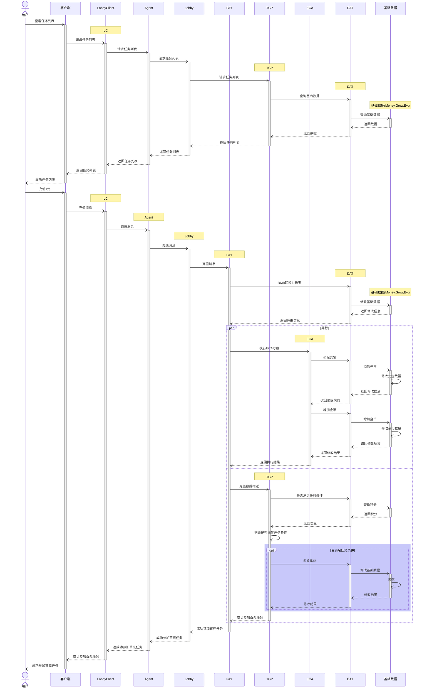

---

categories: 工作 业务相关       # 分类

tags: 工作 业务相关 mermaid      # 标签

mermaid: true

---

### 需求一：

```mermaid
sequenceDiagram
actor 用户
  用户 -)+ 客户端: 查看任务列表
  participant LC as LobbyClient
  Note over LC: LC
  客户端 -)+ LC: 请求任务列表
  LC -)+ Agent: 请求任务列表
  Agent -)+ Lobby: 请求任务列表
  participant PAY
  Note over TGP: TGP
  participant ECA
  Lobby -)+ TGP: 请求任务列表
  Note over DAT: DAT
  participant JC as 基础数据
  TGP -)+ DAT: 查询基础数据
  Note over JC: 基础数据(Money,Grow,Evt)
  DAT -)+ JC: 查询基础数据
  JC --)- DAT: 返回数据
  DAT --)- TGP: 返回数据
  TGP --)- Lobby: 返回任务列表
  Lobby --)- Agent: 返回任务列表 
  Agent --)- LC: 返回任务列表 
  LC --)- 客户端: 返回任务列表 
  客户端 --)- 用户: 展示任务列表 

  用户 -)+ 客户端: 充值1元
  Note over LC: LC
  客户端 -)+ LC: 充值消息
  Note over Agent: Agent
  LC -)+ Agent: 充值消息
  Note over Lobby: Lobby
  Agent -)+ Lobby: 充值消息
  Note over PAY: PAY
  Lobby -)+ PAY: 充值消息
  Note over DAT: DAT
  PAY -)+ DAT: RMB转换为元宝
  Note over JC: 基础数据(Money,Grow,Evt)
  DAT -)+ JC: 修改基础数据
  JC --)- DAT: 返回修改信息
  DAT --)- PAY: 返回转换信息
  par 并行
 	Note over ECA: ECA
    PAY -)+ ECA: 执行ECA方案
    ECA -)+ DAT: 扣除元宝
    DAT -)+ JC: 扣除元宝
    JC -) JC: 修改元宝数量
    JC --)- DAT: 返回修改信息
    DAT --)- ECA: 返回扣除信息
    ECA -)+ DAT: 增加金币
    DAT -)+ JC: 增加金币
    JC -) JC: 修改金币数量
    JC --)- DAT:返回修改结果
    DAT --)- ECA:返回修改结果
    ECA --)- PAY: 返回执行结果
  and
  	Note over TGP: TGP
    PAY -)+ TGP: 充值数据推送
    TGP -)+ DAT: 是否满足任务条件
    DAT -)+ JC: 查询积分
    JC --)- DAT: 返回积分
    DAT --)- TGP: 返回信息
    TGP -) TGP: 判断是否满足任务条件
    rect rgb(200, 200, 250)
    opt 若满足任务条件
    TGP -)+ DAT: 发放奖励
    DAT -)+ JC: 修改基础数据
    JC -) JC: 修改
    JC --)- DAT:修改结果
    DAT --)- TGP:修改结果
    end
    end
    TGP --)- PAY:成功参加首充任务
  end
  PAY --)- Lobby: 成功参加首充任务
  Lobby --)- Agent: 成功参加首充任务
  Agent --)- LC: 返成功参加首充任务
  LC --)- 客户端: 成功参加首充任务
  客户端 --)- 用户: 成功参加首充任务
```

