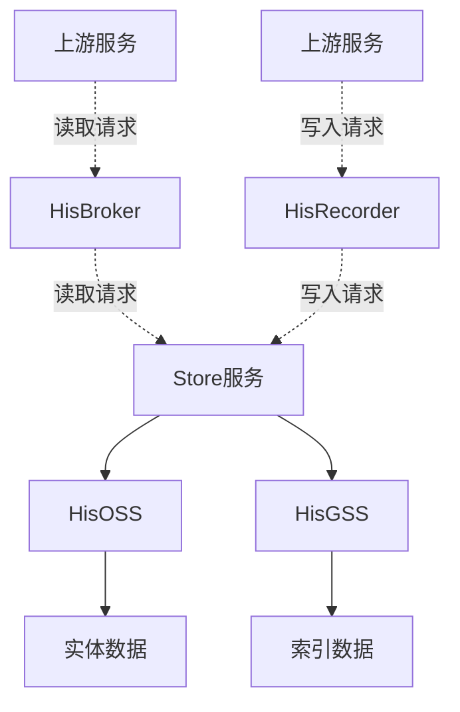

---

categories: 工作  系统相关       # 分类

tags: 工作  系统相关 精心整理 mermaid     # 标签

---


# HIS重构设计

作者：韩盛柏

## 一、HIS系统概述

### 1. 系统定位与核心功能

HIS 系统是支撑复杂数据存储与查询的核心平台，主要功能包括：  

- **数据存储**：分离原始数据（OSS）与索引数据（GSS），支持大数据量的存储需求和快速多样的查询需求。  
- **动态扩展**：通过配置化规则满足不同业务需求（如战绩、收藏、奖状等）。  
- **协议兼容**：复用历史通信协议，保障新旧业务平滑过渡。  

### 2. 系统架构



- **HisBroker**：承接来自上游服务的查询请求，协议透传，方便HIS系统内部对Store服务进行升级维护。
- **HisRecorder**：承接来自上游服务的写入请求，方便HIS系统内部对Store服务进行升级维护。
- **HisStore**：协议解析、路由分发、数据加工（支持新旧协议兼容）。  
- **HisOSS**：提供对实体数据的存储和查询功能。  
- **HisGSS**：按照业务配置对索引数据提供加工、存储、查询等功能。


## 二、重构背景与核心问题

### 1. 重构背景

| **问题**         | **表现**                                                     |
| ---------------- | ------------------------------------------------------------ |
| **存储架构多样** | GSS混合使用MySQL、Redis，多技术栈维护成本高。<br/>OSS使用Cassandra老旧技术栈，不利于未来发展和后期维护。 |
| **可维护性差**   | 针对老业务，Store服务有17个专用协议、几十处硬编码的补丁逻辑；<br/>GSS有4个模型是业务定制的。老业务迭代维护困难。 |
| **拓展性不足**   | 对新业务而言，若包含特殊逻辑，Store需要做定制化开发，业务的拓展性较低；<br/>gss模型支持的业务类型较为单一，不利于业务多样性的发展。 |
| **CVS配置复杂**  | 拆分服务较多，CVS配置规则较为复杂，store配置与gss以及oss有较多纠缠<br/>且配置规则复杂，不易后期维护。 |
| **功能缺失**     | 当前的HIS系统，不支持动态修改（如棋谱编辑）、动态删除（删除收藏） |
| **资源瓶颈**     | 当前gss过于依赖redis内存存储，数据建模及业务资源使用均受限。 |

### 2. 重构目标

- **统一存储层**：GSS 和 OSS 使用 MongoDB 作为主要存储，有利于后期维护（gss会保留部分MySQL、redis的业务）。针对gss，使用更加适合索引结构的MongoDB，有利于未来的业务拓展和维护。
- **业务扩展**：通过对 GSS 进行 MongoDB 的抽象化建模，可以支持更多业务场景。 对 Store 进行 ETL 功能配置化修改，可以支持更多定制化的功能。
- **功能拓展**：HIS支持修改、删除的操作。
- **统一配置**：HIS的所有CVS配置表统一。


## 三、核心改造方案

整体分为如下几个阶段：

1. **OSS 由 Cassandra 改造为 MongoDB**。全面替代 Cassandra，代码开发完成后，通过双跑+脚本迁移的方式对现有存储做全量迁移。
2. **GSS 使用 MongoDB 对业务模型重新建模**。了解当前gss的所有业务、数据模型、ops量；下线不再使用的业务及配置；使用 MongoDB 进行数据建模；对mongo模型进行基本测试和压力测试；通过双跑逐步迁移gss上的业务。
3. **为 HIS 新增删改功能**。当前 HIS 不支持业务对数据的修改和删除，需要新增相关的接口和功能。
4. **HIS 系统使用统一的 CVS 配置**。当前 HIS 系统中的三个服务有三个 CVS 配置表，相互耦合，使用复杂，维护困难。统一为一张 CVS 表以后，有利于业务拓展及后期维护。
5. **为 Store 开发 ETL 规则**。当前 Store 中有很多定制化的补丁，后期拓展性为0，若要支持更多的业务，需要为 Store 提供配置化的 ETL 解决方案。

### 1. OSS服务升级成果

#### 1）Cassandra→MongoDB迁移收益

| **指标** | **Cassandra**                                       | **MongoDB**                                                  | **优化幅度** |
| -------- | --------------------------------------------------- | ------------------------------------------------------------ | ------------ |
| CPU      | 116核                                               | 110核心                                                      | -5.05%       |
| 内存     | 976G                                                | 220G                                                         | -344%        |
| 磁盘     | 26.3T                                               | 14.65T                                                       | -79.52%      |
| 说明     | 集群配置变化：<br/>8核64G1.7T * 16→<br/>4c16g300G*3 | 集群配置：<br/>mongos：4核8G50G * 2<br/>config：2核4G50G * 3<br/>shard：8核16G1.2T * 12 |              |

>
> 以上统计信息来自暴常军。
>
> 注：Cassandra 集群是 his 系统跟 sns 系统混用的， his 改造完后，仅剩 sns 的 Cassandra 集群缩减成了3个节点小配置集群。

#### 2）关键技术

- **过期数据清理**：由 DBA 建立日表，日表固定在 31 天后过期。
- **压缩算法**：OSS 中存储的数据转为 Base64 压缩算法，存储体积减少 30%。  
- **性能表现**：当前 OSS-Mongo 的 ops： 484~1847，写入延迟： 2.40~3.05 ms（CMA监控项：`OSSStatic.putTick_`），读取延迟：1.20~2.00ms（CMA监控项：`OSSStatic.getTick_`）。（统计时间：2025年3月12日）

### 2. GSS存储模型重构  

#### 1）与redis模型对比


<table>
  <tr>
    <th>对比维度</th>
    <th>详细内容</th>
    <th>redis模型</th>
    <th>mongo模型</th>
  </tr>
  <tr>
    <th rowspan="5">业务功能</th>
    <th>最大长度截断</th>
    <td>支持</td>
    <td>支持</td>
  </tr>
  <tr>
    <th>白名单过滤</th>
    <td>支持</td>
    <td>支持</td>
  </tr>
  <tr>
    <th>过期时间</th>
    <td>隐患：仅能在key层面设置TTL</td>
    <td>完善：doc和array中的元素均可实现过期删除</td>
  </tr>
  <tr>
    <th>多端写入</th>
    <td>复杂：需要硬编码判断</td>
    <td>简单：明确字段后自然支持</td>
  </tr>
  <tr>
    <th>查询能力</th>
    <td>单一：键值查询</td>
    <td>多样：聚合管道、多字段索引、</br>指定排序规则</td>
  </tr>
  <tr>
    <th rowspan="4">性能表现</th>
    <th>ops数量</th>
    <td>1次写入需要3个ops</br>1次读取1个ops</td>
    <td>1次操作1个ops</td>
  </tr>
  <tr>
    <th>读取延迟</th>
    <td>0.44-0.53ms</td>
    <td>15.8-22.0ms</td>
  </tr>
  <tr>
    <th>读取延迟</th>
    <td>0.44-0.53ms</td>
    <td>15.8-22.0ms</td>
  </tr>
  <tr>
    <th>写入延迟</th>
    <td>3.86-7.42ms</td>
    <td>98.4-156.2ms</td>
  </tr>
  <tr>
    <th rowspan="2">维护拓展</th>
    <th>数据库维护</th>
    <td>Codis无最新版本迭代</td>
    <td>有丰富的MongoDB社区，
    </br>
    有持续的升级维护</td>
  </tr>
  <tr>
    <th>存储成本</th>
    <td>内存存储，业务拓展成本高</td>
    <td>磁盘存储，拓展成本低</td>
  </tr>
</table>


> 读写延迟数据来自双跑测试时的数据，CMA监控项：`GSSStatic.insTick_`、`GSSStatic.seaTick_`。
>
> 读写延迟都是用的内网测试环境的，内网的MongoDB是单实例，性能远低于实际上线的环境，因此这里的**读写延迟应该在外网资源配好后重新测试** 再做完善。


#### 2）MongoArray模型

MongoArrayModel 是 gss 重构后主要使用的数据模型，适合当前的大部分业务，尤其是 “最近n” 的业务类型。

一个实际需要迁移的线上业务：【斗地主近20次夺冠时间，ddzbtime】

##### CVS配置

```json
{
  "hid": 2602,
  "type": "mongoarraymodel",
  "pidfield": "",
  "rollingcycle": "",
  "tablename": "",
  "keepday": 0,
  "maxlength": 20,
  "keyfields": [
    "pid",
    "mpid"
  ],
  "valuefields": [
    "mpid",
    "at"
  ],
  "whitelist": [
    {
      "key": "rank",
      "values": [
        1
      ]
    }
  ],
  "mongoCluster": "mongo_hisgss",
  "mongoDatabase": "GSS_test",
  "mongoCollection": "testDDZBTIME"
}
```


##### MongoDB 文档示意

```json
{
  "_id": { "$oid": "67c6c3d0f575f91328345c5a" },
  "mpid": 2005158,
  "pid": 1025023,
  "arrayData": [
    {
      "mpid": 2005158,
      "at": 1741312321,
      "_id": { "$oid": "67ca512b83d15cd092436df3" },
      "_ts": { "$date": "2025-03-07T01:51:39.138Z" }
    },
    {
      "mpid": 2005158,
      "at": 1741312236,
      "_id": { "$oid": "67ca50d683d15cd092436c17" },
      "_ts": { "$date": "2025-03-07T01:50:14.105Z" }
    },
    {
      "mpid": 2005158,
      "at": 1741309213,
      "_id": { "$oid": "67ca450883d15cd0924310c7" },
      "_ts": { "$date": "2025-03-07T00:59:52.603Z" }
    },...      
  ]
}
}
```


#### 3）关键技术

- **动态过期**：
  - 文档过期：通过 MongoDB 的TTL实现。
  - array元素过期：基于元素中的`_ts`字段，在查询时清理过期元素。
- **原子操作**：插入时通过`$push` + `$slice` 实现高效截断。
- **聚合操作**：查询时，通过 `find_one_and_update`函数实现功能聚合，减少了 ops 量。
- **白名单过滤**：模型中保留过滤功能，通过CVS配置过滤条件。  
- **定位准确**：在 array 的每一个元素中增加`_oid`字段作为唯一标识，以提供准确的删改操作。
- **多重索引**：在同一个MongoDB集合中，可将多个字段设置为索引，以提供多维度的检索方式。


### 3. HIS功能拓展

#### 1）背景

当前的HIS仅支持新增和查询两种操作，并不支持修改和删除。

来自象棋的业务方提出了“象棋棋谱”需求，在该需求中，需要针对已有棋谱进行修改，也需要对已收藏的棋谱进行删除，因此 HIS 系统需要新增修改和删除两种功能。

另外，需要对查询接口进行修改，当前Lobby向客户端提供的查询接口是老接口，缺少两个字段，功能不全。

#### 2）关键技术

- **增加新接口**：需要联系 Lobby 增加新的接口，因为新接口的目标用户为客户端。
- **限制客户端写入号段**：为了防止客户端恶意写入，在 Lobby 侧限制了客户端能够调用接口的 hid 号段（10000 ~ 19999）。


## 四、升级方案

### 1. 服务热更新方案

> 不管是 store、gss、oss，热更新流程是一致的，如下所示。

- 从 TKHisStoreService 的平台/服务进入【配置变更】，对 `TKService.ini` 进行增量变更。
- 将 B 组的流量迁移到 A 组。
- 升级 B 组的服务。
- 将 B 组的流量切回 B 组。
- 通过 CMA 监控观察业务流量是否正常。
- 升级 A 组同上。


### 2. 业务迁移方案

- 通过对业务的梳理和测试，暂定第一批迁移的gss业务。
- 在外网搭建双跑环境，对第一批gss业务进行迁移。
- 完善剩余的gss业务的mongo模型，分批迁移其余业务。


### 3. 风险与应对

| **风险项**                  | **应对策略**                                                 |
| --------------------------- | ------------------------------------------------------------ |
| redis和mongo数据不一致      | 在双跑支路异步实时对比，通过CMA监控和日志对读写情况进行监控  |
| mongo支路崩溃对主流程的影响 | store分流时均采用异步操作，异步支路发生任何问题直接销毁，不对主流程造成影响 |
| mongo集群配置不够           | 逐步迁移业务，mongo集群硬盘或ops量不够的话，及时联系DBA升级mongo集群 |
| ！主流程GSS需提前升级       | 在内网提前进行测试，外网的GSS逐步升级                        |


## 五、预期收益

- **存储成本下降**：Redis 下线后，内存资源节省35%；通过数据压缩，OSS 降低 30% 存储量。
- **维护便捷**： 
  - 技术栈统一，之后仅使用 MongoDB，减少了学习成本。
  - CVS 配置由三个统一为一个，减少后期运维成本。
  - Store 支持通过配置进行 ETL 操作，有定制化业务需求的时候不再需要编码和升级。
- **功能扩展**：
  - gss 支持更灵活多样的业务模型。例如社交类、公告类的非格式化的数据。
  - HIS 系统支持修改、删除操作。
- [占位符]


## 六、附录

### 1. Mongo性能测试报告

测试业务模型 maxLen=20，基本的读写功能测试结果如下：

| 测试内容 | 并发量(k/min) | 时延(ms)   | 备注                                  |
| -------- | ------------- | ---------- | ------------------------------------- |
| 写入     | 60.85~66.37   | 4.25~4.51  | 随机插入（带截断）                    |
| 读取     | 57.34~58.8    | 9.84~10.14 | userid 随机插入（有超过maxLen的数据） |

此外还测试了不同并发量下的时延表现、MongoDB数据量对查询效率的影响、不同文档结构下MongoDB占用空间的情况，整体结论如下：

- 上游请求越多（写入线程数多），GSS 并发量越高，写入时延越高。
- 写入速度从快到慢：
  - SingleModel 不按照 maxLen 截断（4.30~4.83 ms）
  - ArrayModel 按照 maxLen 截断（7.03~8.50 ms）
  - SingleModel 按照 maxLen 截断（9.84~10.14 ms）
  - ArrayModel 按照 maxLen 截断 + 按照TTL移除过期元素（未测试，从复杂度上推测此查询最慢）
- 查询效率：
  - **ArrayModel 的查询效率略高于 SingleModel**：
    - 查询并发量：ArrayModel 为 SingleModel 的 1.2 倍左右。
    - 查询时延：SingleModel 为 ArrayModel 的 1.1 倍左右。
  - 在测试范围内（0~5000W 条），MongoDB 集合中的整体数据量对查询效率基本没有影响。
  - 单次请求数据量越多，查询的时延越高。


### 2.  Mongo压测报告 

#### 1）测试目标

- 最大吞吐量下，GSS 的 Mongo 模型的表现性能。

- 模拟在真实业务场景下（1:30 的读写比例），GSS 的 Mongo 模型表现情况。

  > 现在真实业务情况下 GSS 的读写情况：写入：73 k/min，读取：2.4 k/min。比例为 30:1 。

#### 2）压测结论

- 压测的流量（220 k/min）为目前 his 真实流量（73 k/min）的 3 倍，测试结果足够体现真实场景。
- 随着读写量的增加，GSS的性能表现逐步下降，具体表现为读写删的时延逐步提升。

- 在相当压力下，GSS 中的 Mongo 模型均能表现出不错的读写性能（时延均在可接受范围内）。


### 3. 双跑详细设计

1. 完成GSS编码。保证接口不变，在Model中新增使用MongoDB的模型，通过hid与CVS配合使用。

2. 完成Store编码。在Store中搭建双跑系统，配合store.ini实现双跑逻辑（见本md文档同路径的流程图：`2025新GSS双跑设计.drawio`）

3. 内网测试。按照如下流程测试双跑流程和正式流程。

4. 向DBA申请如下资源：【MySQL和redis直接用内网的够用吗】

   - MongoDB资源。用于GSS双跑和正式使用。并提前创建目标业务的表、按照业务配置设置好索引。

5. 搭建GSS双跑环境。在4或8台机器上布置双跑的GSS。搭建双跑环境可参考：`HIS-双跑准备+升级服务.md`

6. 升级老GSS服务。因为新旧gss业务都是写在同一张 `define_hisgss` 表上，如果老GSS不升级的话就会导致CVS配置解析失败。（**这里会有一定隐患**：因为GSS修改的比较多，如果对老业务造成影响的话，这里会出问题，因此在这一步之前，需要对新GSS做充分测试）

7. 修改CVS配置。将要迁移的业务，按照新MongoDB模型，写好配置，新旧配置都放在 define_hisgss 中。

8. 修改 store.ini 配置。将所有需要迁移的业务配置在store.ini中。配置示例如下：

   ```ini
   [DoubleRun]
   DoubleRunGSS=ddzbtime:ddzbtime_m:2,coupleteam:coupleteam_m:2,
   ;参数解释：“老业务配置名：新业务配置名：双跑状态，... ”
   ```

9. 升级所有的Store服务（包含双跑代码）。但此时还未开始双跑，因为ini中配置的双跑状态默认为1。

10. 开始双跑。修改 store.ini 配置，将双跑状态统一修改为 2，开始向支线 GSS 双跑。

11. 双跑一段时间（一个月？），观察双跑成功率的状态，确定新 GSS.exe 服务没有问题。

12. 迁移老数据。将要迁移业务在redis上的数据迁移至MongoDB中。保证MongoDB中的数据与redis全量相同，且从新老GSS中获取的数据均一致。

13. 将“要迁移业务”的流量切到双跑支路。修改 store.ini 配置，双跑状态统一修改为 3，此时，store 针对“要迁移业务”，将旧hid转为新hid，仅通过主流程的GSS传入新hid获取新的来自MongoDB的结果。

14. 修改CVS配置，将老hid的配置改为新的使用MongoDB的模型配置。

15. 修改 双跑状态为1，此时，主流程的GSS通过老hid的配置从MongoDB读写新的数据。

16. 双跑结束。将store服务替换为没有双跑代码的版本。

17. 回收双跑资源。