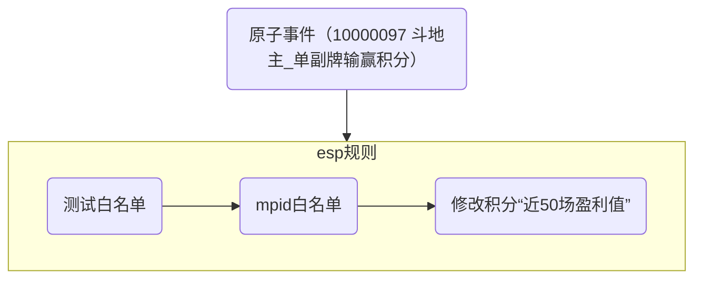
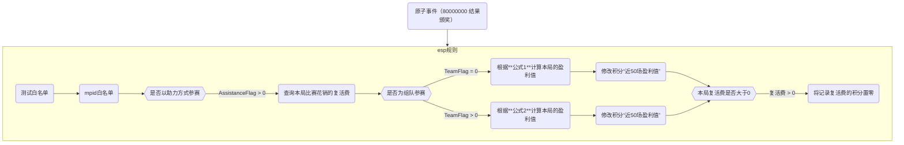

---

categories: 工作 业务相关       # 分类

tags: 工作 业务相关 EVT     # 标签

mermaid: true

---

# 2025玩家盈利能力EVT标签v2.0

> 本文同样有钉钉线上文档。本地文档为最新，以本地为准。

## 1  背景

我们希望能够优化斗地主的游戏生态，最终理想的状态是让玩家和彼此水平相近的对手组桌，因此我们需要先给出**玩家水平的量化标准**。

为了给玩家的打牌水平设计量化的衡量标准，拟采用玩家在某个场地中的近 N 副牌的输赢金币数（筹码积分数）的平均数作为具体的指标，本文简称“盈利能力”指标。

## 2  历史版本

### 2.1  版本v1.0：斗地主比赛近50场比赛胜场数

v1 版本于2022年1月上线，通过记录最近 50 场比赛的胜场数（积分id：60033027）来作为玩家水平的量化标准，目前已下线并清理。

### 2.2  版本v1.5：近50副输赢积分均值

v1.5 版本于2025年2月上线，通过记录最近 50 场的输赢分（积分id：64795321）来作为玩家水平的量化标准。截止目前（2025年5月14日）一直作为线上的“盈利能力”指标在使用。

v1.5 版本会在v2.0版本正式上线后下线+清理。

v1.5 版本配置详情：

*   积分：
  
    *   64795321，recentresultex 模型，记录近50副输赢积分均值。
      
    *   64795322，fusecom 模型，用于查询。因为客户端不支持负值，因此此积分负责将 64795321 加一个极大值后返回。
    
*   esp规则：
  
    *   触发原子事件：10000097（斗地主\_单副牌输赢积分）
      
    *   description：斗地主比赛近50场比赛胜场数
      
    *   逻辑：判断 mpid 白名单 → 修改积分 64795321 的值
      

### 2.3  历史版本的问题

1.  在不足50副的情况下，仍然计算平均值，可能会造成前几副牌用户赢得多一点，然后被系统标记为高水平用户之后，面对真正的高手遇到挫败而体验很差；
  
2.  历史版本只适用于自由桌，锦标赛还缺少对应的盈利能力的标签，且不能照搬自由桌的计算规则；
  
3.  积分未配置 TTL 清理时间，会堆积无用的数据。
  

## 3  新版标签

### 3.1  整体思路

针对以上问题，v2.0 版本的 “盈利能力” 指标对计算方式进行了优化：

针对每个比赛（以 mpid 区分），设置一个 “盈利能力” 指标的 **阈值**，当玩家游戏的局数小于等于 **N 副**时，取 `min(阈值，近50场输赢分均值)` 作为 “盈利能力” 的指标值。防止用户新到某个场地时，前几副牌手气特别好，赢得特别多而被系统标记为高水平玩家导致其后面的对局遇到高手而体验较差。

> **阈值**：每个 mpid 不同，且需支持上线初期进行修改，以便优化标签的效果。
>
> **N 副**：N<50，所有比赛都一样，当前暂定为 10，需支持上线初期进行修改，以便优化标签效果。

针对 **每一场的盈利值**，自由桌和锦标赛的计算规则不同：

*   自由桌直接取原子事件  10000097 中的 “单副牌输赢积分” 记录即可。
  
*   锦标赛则需要将获得的各种奖励和物品进行折算，规则较为复杂，后面详细说明。
  

### 3.2  写入逻辑

不论自由桌还是锦标赛，写入目标都是一个 recentresultex 类型的积分，该积分区分mpid，记录了 “近50场盈利值” ，支持查询 “近50场盈利值” 的 **均值** 和 **有效场次数**。

依据产品需求，自由桌和锦标赛在写入时逻辑不同，具体如下。

#### （1）自由桌

*   **mpid 白名单**：2970,2966,2967,401,416,461,90916,36545,36546,36548,36553,36575,9000,9004,9006,9051,9021,73002,555,556,73010,73024,503002,503074,503075,503076,502972,2007402

#### （2）锦标赛

*   **mpid白名单**：995,994,479,451,501,996,36595,36596,36531,36534,36551,9071,9072,9038,9030,9020,73044,73045,73007,73008,73021,2007425,2007424
  
*   **公式1**：晋级奖(BoutPromote) + 赢牌奖(HandWin) + 复活返利赠送的秋卡(ReliveRebate-2-889) × 12 + 排名奖(M2) + 秋卡(W889) × 12 + 5元话费(W11610) × 6000 + 10元话费(W11611) × 12000 + 10元充值卡(W22161) × 12000 + 大米碎片(W21343) × 350 - 复活费
  
*   **公式2**：晋级奖(BoutPromote) + 赢牌奖(HandWin) + 复活返利赠送的秋卡(ReliveRebate-2-889) × 12 + 排名奖(RealAward-1-2) + 秋卡(RealAward-2-889) × 12 + 5元话费(RealAward-2-11610) × 6000 + 10元话费(RealAward-2-11611) × 12000 + 10元充值卡(RealAward-2-22161) × 12000 + 大米碎片(RealAward-2-21343) × 350 - 复活费
  
*   **复活费**：由比赛发送原子事件（10000306 斗地主\_锦标赛复活费），再由 esp 记录到一个积分里。
  

### 3.3  读取逻辑

不论自由桌还是锦标赛，读取的实现逻辑都是一样的。

EVT 会通过配置自动实现如下逻辑：

*   查询 “近50场盈利 **平均值**” 和 “近50场 **有效场次数**”
  
*   `if (有效场次数 < 10 && 平均值 > 阈值)` ：返回阈值
  
*   `else`：返回平均值
  

上游服务可通过查询积分 **60777005** 来实现上述逻辑，获得想要的结果。

### 3.4  配置详情

#### （1）积分：

*   **60777000**：近50副牌的真实输赢分(recentresultex) 查询方式：average，**负责写入** 与实体存储。expiretime：7776000（90天，与判断回流用户时间保持一致）
  
*   **60777001**：近50副牌的真实输赢分-查询场次数(recentresultex) 查询方式：memcount，视图积分，没有存储实体，只负责查询 60777000 的当前有效场次。
  
*   **60777002**：每场比赛的阈值(keyint) ：需要修改时由产品联系运维进行修改。（*设置此积分时无需增加极大值*）
  
*   **60777004**：近50副牌的输赢分-查询(fusecom)：实现主要的读取逻辑。
  
*   **60777005**：近50副牌的输赢分-正数-查询(fusecom) ：60777004 加一个极大值后返回，**负责查询**。
  
*   **60777006**：用户在当前比赛花销的复活费(normal) ：只锦标赛会用到，用来记录此局花销的复活费。expiretime：604800（7天，与存档时间）
  

**积分说明：**

*   区分mpid：所有积分均区分mpid。
  
*   积分应用范围：积分 60777006（复活费）只有锦标赛会用到，其他积分均是自由桌和锦标赛都会用到。
  
*   60777005 为何需要加极大值后返回：“近50场输赢分均值” 是可能出现负值的，但外围查询的时候不支持解析负值，因此需要增加一个极大值返回，保证返回是一个绝对正数**。**
  
*   极大值：60777005 增加的极大值是 100000000（一亿）。其它积分均不考虑极大值的事，都是原值。
  
*   存储实体：仅 60777000 和 60777006 两个积分会有存储实体，其他积分都是为了实现读写逻辑。
  
*   过期时间：与产品沟通，产品接受积分 60777000 存在过期时间。60777006 只是用于计算当前比赛的输赢分，因此过期时间与存档时间对齐即可。
  

#### （2）esp 配置：

*   自由桌：
  
    *   sid：10000097（斗地主\_单副牌输赢积分），由CMT发送。修改积分 60777000。
    
*   锦标赛：
  
    *   sid：10000306（斗地主\_锦标赛复活费），由比赛发送。修改积分 60777006。
      
    *   sid：80000000（结果颁奖），由CMT发送。实现锦标赛的盈利标签计算逻辑，最后修改 60777000。
      

## 4 统计

### 4.1  目标

1.  通过统计结果对上面提到的“阈值”进行调整。
  
2.  评估每个比赛所有用户的水平区间，用以匹配对应水平的机器人。
  

### 4.2  实现逻辑

打开积分 60777000（近50副牌的真实输赢分）的账单，通过现有流程落盘账单，通过数数直接配置EVT积分的数值分布看板解决。