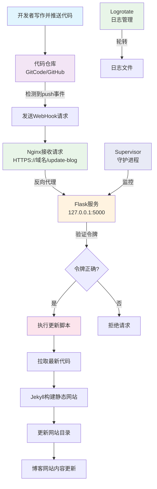

---

categories: 技术 需求操作文档      # 分类

tags: 技术 需求操作文档 个人网站 精心整理 python   # 标签

mermaid: true 

description: 基于 Flask + WebHook + Supervisor 的博客自动化部署实践方案
---


> Flask 相关内容见文档：[2025-12-24-flask维护手册.md](https://www.blog.klizzard.top/posts/flask维护手册/)
>
> 本文写的服务用于个人 blog，见文档：[2025-10-14-部署个人博客.md](https://www.blog.klizzard.top/posts/部署个人博客/)

## 1. 背景

- 目标：gitcode 上有最新的提交后，服务器会自动 fetch 最新代码，并自动完成 blog 网站的更新。
- 技术方案：使用了 GitHub 的 WebHook ，并在 Ubuntu 上布置了对应的 Flask 服务。

## 2. 服务器部署接口（Flask 服务）

- 服务器安装 Web 服务依赖（用于接收 GitHub 回调）：

```bash
sudo apt install -y python3-pip
pip3 install flask
```

- 编写 WebHook 服务脚本（`webhook-server.py`）：：

```bash
nano /var/myblog/webhook-server.py
```

- py 脚本功能：（**实际代码见服务器**）
  - **利用Flask监听5000端口**：端口号定义见脚本。
  - **接收 GitCode 推送通知**：监听 `http://[域名]:5000/update-blog` 的 POST 请求（GitCode 检测到代码推送时会自动推送）
  - **执行安全验证**：验证请求头中的令牌（`X-GitCode-Token`）是否与预设的 `SECRET` 一致。
  - **触发自动化构建**：验证通过后，自动执行系统脚本 `/var/myblog/abuild.sh`，该脚本负责拉取 git、拷贝替代、构建 jekyll。
  - **提供执行反馈**：根据脚本执行结果返回对应的状态码。
  - **记录运行日志**：输出详细日志到标准输出，便于监控和故障排查。
  
- 若需要通过 ip + 端口 的方式访问接口，需要在阿里云上为 5000 端口开放防火墙。

  > 打开 5000 端口的防火墙后，在日志  webhook.err.log 中会看到很多外部网络的无效请求或恶意扫描相关的日志。是因为 5000 端口是开放了 0.0.0.0:5000 ，整个公网可访问。
  > 所以测试完就把端口号关上吧
  >
{: .prompt-warning }

- 若按照本文后面的操作使用 Nginx 反向代理，就可以不开放 5000 端口的防火墙了。


**测试运行脚本**：（这一步可以跳过，因为后面会使用 supervisor 管理）

- 使用 `nohup` 命令后台运行 WebHook 服务：

```bash
root@Hanbai-Linux:/var/myblog# nohup python3 /var/myblog/webhook-server.py &
[1] 81630
root@Hanbai-Linux:/var/myblog# nohup: ignoring input and appending output to 'nohup.out'
```

如上所示输出，webhook-server.py 已经成功在后台启动了，`[1] 81630` 是服务的进程 ID，`nohup: ignoring input and appending output to 'nohup.out'` 是正常提示，表示日志会写入当前目录的 `nohup.out` 文件。

- 再次校验是否成功运行，查看 webhook-server.py 对应的进程是否存在：

```bash
root@Hanbai-Linux:/var/myblog# ps -ef | grep webhook-server.py
root       81630   60892  0 18:19 pts/0    00:00:00 python3 /var/myblog/webhook-server.py
root       81688   60892  0 18:21 pts/0    00:00:00 grep --color=auto webhook-server.py
root@Hanbai-Linux:/var/myblog# 
```

- 验证接口是否正常响应：

```bash
# 发送 POST 请求，带上脚本中设置的 SECRET（替换为实际的密钥，比如 123456）
curl -X POST http://localhost:5000/update-blog \
  -H "Content-Type: application/json" \
  -d '{"secret": "952581716"}'  # 这里的 secret 要和脚本中 SECRET 变量一致
```


## 3. supervisor 管理接口

### 3.1 supervisor 配置

用 `nohup` 启动的服务，**服务器重启后会自动停止**，若想让服务开机自启，推荐用 `supervisor` 管理：

- 安装 supervisor：

```bash
sudo apt install -y supervisor
```

- 新建配置文件，让 supervisor 管理 webhook 服务：

```bash
sudo nano /etc/supervisor/conf.d/webhook.conf
```

- 粘贴以下内容（修改路径为实际路径）：

```ini
[program:webhook-server]
command=python3 /var/myblog/webhook-server.py  ; 服务启动命令
directory=/var/myblog  ; 工作目录（日志会保存在这里）
autostart=true  ; 开机自启
autorestart=true  ; 服务崩溃后自动重启
stderr_logfile=/var/log/webhook.err.log  ; 错误日志
stdout_logfile=/var/log/webhook.out.log  ; 正常日志
user=root  ; 执行服务的用户（用 root 或其他常用的用户）
```

- 启动 supervisor 并加载配置：

```bash
sudo supervisorctl reload
# 查看服务状态（显示 RUNNING 即正常）
sudo supervisorctl status webhook-server
```

这样后续服务器重启，webhook 服务会自动启动，无需手动执行 `nohup` 命令。

### 3.2 supervisor 重启服务

若修改了 py 脚本后，需要通过 supervisor 重启服务，加载新代码：

```bash
# 格式：sudo supervisorctl restart 服务名
#（服务名在 webhook.conf 中定义，即 [program:xxx] 中的 xxx）
sudo supervisorctl restart webhook-server
```


## 4. Nginx 反向代理

将 WebHook 请求从 `http://IP:5000/update-blog` 转发到 `https://www.blog.klizzard.top/update-blog`，通过 Nginx 处理 HTTPS 并代理到本地 5000 端口的 Flask 服务。

1. **编辑 Nginx 配置文件**（假设博客的 Nginx 配置文件为 `/etc/nginx/sites-available/blog`）：

   ```bash
   sudo nano /etc/nginx/sites-available/blog
   ```

   

2. **添加反向代理规则**：找到 `server_name www.blog.klizzard.top;` 对应的 443 服务器块，在 `location / { ... }` 下方添加 `location /update-blog` 反向代理配置，修改后如下：：

   ```nginx
   server {
       server_name www.blog.klizzard.top;
       
       # 原有博客静态文件配置
       location / {
           root /var/myblog/blog/_site;     # Jekyll 构建的静态文件路径
           index index.html index.htm;
       }
   
       # 新增：WebHook 反向代理配置（核心内容）
       location /update-blog {
           proxy_pass http://127.0.0.1:5000/update-blog;  # 转发到本地 Flask 服务
           proxy_set_header Host $host;                   # 传递请求域名
           proxy_set_header X-Real-IP $remote_addr;       # 传递真实客户端 IP
           proxy_set_header X-Forwarded-For $proxy_add_x_forwarded_for;
           proxy_set_header X-Forwarded-Proto $scheme;   # 传递 HTTPS 协议标识
           proxy_next_upstream error timeout invalid_header http_500 http_502 http_503 http_504;  # 异常处理
       }
   
       # 原有 SSL 配置（保持不变）
       listen 443 ssl; # managed by Certbot
       ssl_certificate /etc/letsencrypt/live/klizzard.top/fullchain.pem; # managed by Certbot
       ssl_certificate_key /etc/letsencrypt/live/klizzard.top/privkey.pem; # managed by Certbot
       include /etc/letsencrypt/options-ssl-nginx.conf; # managed by Certbot
       ssl_dhparam /etc/letsencrypt/ssl-dhparams.pem; # managed by Certbot
   }
   ```

3. **验证 Nginx 配置并重启**：

   ```bash
   sudo nginx -t        # 检查配置语法
   sudo systemctl restart nginx         # 重启 Nginx 生效
   ```


## 5. git 的 WebHook 配置

> 本文最后其实是采用的 GitCode 作为云仓库进行同步的，因为 Github 在服务器上有时候会拉取失败。
>
> 但无论 GitCode 还是 Github，操作步骤和顺序都是一样的。

进入存放博客文章的仓库（就是本地 Typora 编辑文章后提交的仓库），按以下步骤配置 WebHook：

### 5.1 进入仓库 WebHook 配置页

仓库主页 → 点击顶部「Settings」→ 左侧菜单找到「Webhooks」→ 点击右上角「Add webhook」。

### 5.2 填写核心配置项

| 配置项                                                   | 填写内容                                                     |
| -------------------------------------------------------- | ------------------------------------------------------------ |
| **Payload URL**                                          | （详见下面）                                                 |
| **Content type**                                         | 选择 `application/json`（与脚本中接收 JSON 数据的逻辑匹配）  |
| **Secret**                                               | 填写 `webhook-server.py` 脚本中设置的 `SECRET` 值（比如脚本中写的 `123456`，必须完全一致，否则鉴权失败） |
| **Which events would you like to trigger this webhook?** | 选择「Just the push event」（只在 Git 推送代码时触发，避免不必要的请求） |
| **Active**                                               | 勾选（启用 WebHook）                                         |

- Payload URL：填写 `https://[域名]/update-blog`，必须用 HTTPS，避免签名泄露。例如：

  `https://www.blog.klizzard.top/update-blog`

  若没有域名或没有配置 Nginx 反向代理，那就用 “服务器公网 IP + 端口” 来代替，例如：

  `http://59.110.31.194:5000/update-blog`。

### 5.3 保存并测试

点击底部「Add webhook」保存，GitHub 会自动发送一个 “测试请求” 到服务器。


## 6. 管理 Linux 日志

因为 supervisor 会写日志，为避免长时间的日志打爆磁盘，通过 **`logrotate`**（Linux 系统自带的日志轮转工具），配置 supervisor 日志的自动分割、压缩、清理规则，彻底解决日志膨胀问题。

### 6.1 创建 logrotate 配置文件

为 supervisor 日志创建专属的 logrotate 规则：

```bash
sudo nano /etc/logrotate.d/webhook-logs
```

### 6.2 写入配置内容（按需调整参数）

写入以下配置，适配日志路径（`/var/log/webhook.out.log` 和 `/var/log/webhook.err.log`）：

```bash
# 指定需要轮转的日志文件路径
/var/log/webhook.out.log
/var/log/webhook.err.log
{
    daily          # 轮转频率：每天一次
    rotate 7       # 保留7天的日志（超过7天的自动删除）
    size 10M      # 额外触发条件：日志文件超过100M时，立即轮转（不管是否到每天）
    compress       # 轮转后的旧日志自动压缩（节省磁盘空间）
    delaycompress  # 延迟压缩：只压缩前一天的日志（避免压缩正在写入的日志）
    missingok      # 若日志文件不存在，忽略错误（不报错）
    notifempty     # 日志为空时，不执行轮转
    create 0644 root root  # 新建日志文件的权限和所有者（和原日志一致）
    su root root  # 明确指定用户和组为 root，解决权限安全检查问题
}
```

使用以下命令直接生成文件内容，避免额外字符导致文件异常：

```bash
sudo sh -c 'cat > /etc/logrotate.d/webhook-logs << EOF
/var/log/webhook.out.log
/var/log/webhook.err.log
{
    daily
    rotate 7
    size 10M
    compress
    delaycompress
    missingok
    notifempty
    create 0644 root root
}
EOF'
```

### 6.3 验证配置并手动测试

检查配置语法是否正确，若输出中无报错，说明配置有效：

```bash
sudo logrotate -d /etc/logrotate.d/webhook-logs
```

手动触发一次轮转（测试效果）：

```bash
sudo logrotate -f /etc/logrotate.d/webhook-logs
```

执行后查看 `/var/log/` 目录，会生成压缩的旧日志（如 `webhook.out.log.1.gz`），同时创建新的 `webhook.out.log` 文件。

### 6.4 确认 logrotate 自动运行

Linux 系统默认通过 cron 定时执行 logrotate（通常每天凌晨），无需额外配置。可通过以下命令查看定时任务：

```bash
cat /etc/cron.daily/logrotate
```


## 7. 整体流程图

整体流程可以**总结为**：写文章推git → git通知服务器 → 验证后自动build → 网站即刻更新

流程示意如下：



### 核心流程说明

- **触发阶段**：开发者推送代码 → 代码仓库检测到变化 → 发送 WebHook 通知

- **接收处理阶段**：Nginx 接收请求 → 转发给 Flask 服务 → 验证安全令牌 → 执行更新脚本

- **更新阶段**：拉取代码 → 构建网站 → 更新文件 → 网站内容刷新

- **运维保障**：
   - **Supervisor**：确保 Flask 服务持续运行
   - **Logrotate**：自动管理日志文件，防止磁盘占满

### 核心组件关系

| 组件           | 作用   | 类比                           |
| -------------- | ------ | ------------------------------ |
| **WebHook**    | 触发器 | 门铃（有人按门铃就通知你）     |
| **Flask**      | 接收器 | 管家（听到门铃后处理请求）     |
| **Nginx**      | 转发器 | 前台接待（接收外部请求并转发） |
| **Supervisor** | 守护者 | 保安（确保管家一直在岗）       |
| **Logrotate**  | 清洁工 | 保洁（定期清理日志垃圾）       |


## 8. 名词解释

### 1）Flask

**Flask** 是一个轻量级的 Python Web 框架，用于快速构建 Web 应用和 API 接口。本文使用 Flask 创建了一个 WebHook 接收服务，当 GitCode 检测到代码推送时，会向这个 Flask 服务发送 HTTP 请求，触发博客更新的自动化流程。

#### 特点：
- **轻量简单**：核心功能简洁，易于上手，适合小型项目和微服务
- **灵活可扩展**：通过插件可以轻松添加数据库、用户认证等功能
- **开发快速**：几行代码就能创建一个可运行的 Web 服务

### 2）WebHook

**WebHook** 是一种 "反向 API" 机制，允许一个应用程序在特定事件发生时，主动向另一个应用程序发送实时通知。本文通过 WebHook 实现了博客的自动部署：当本地写完文章并推送到 GitCode，服务器会自动获取最新内容并更新网站，无需手动登录服务器操作。

#### 工作原理：
1. **订阅事件**：在服务器上创建一个接收端点（比如 `https://你的域名/update-blog`）
2. **配置触发**：在 GitCode/GitHub 上配置，当有代码推送（push）时，就向这个端点发送 POST 请求
3. **自动执行**：服务器收到请求后，执行预设的脚本（如拉取最新代码、重新构建博客）

#### 与传统轮询的区别：
- **轮询**：客户端不断询问服务器 "有新内容吗？"（效率低，实时性差）
- **WebHook**：服务器主动说 "有新内容了！"（效率高，实时性好）


### 3）Supervisor

**Supervisor** 是一个用 Python 开发的进程管理工具，用于监控和控制后台进程。

#### 主要功能：
- **进程守护**：确保关键服务持续运行，如果进程意外退出会自动重启
- **开机自启**：配置后，服务会在系统启动时自动运行
- **日志管理**：集中收集服务的输出和错误日志
- **Web界面**：提供 Web 管理界面（可选）查看和控制进程状态

**在本文中 Supervisor 用于管理 Flask WebHook 服务：**

- 保证 `webhook-server.py` 持续运行，即使崩溃也会自动重启
- 服务器重启后，Flask 服务会自动启动，无需手动操作
- 集中管理日志，便于排查问题

#### 基本命令：
```bash
sudo supervisorctl status webhook-server  # 查看服务状态
sudo supervisorctl restart webhook-server  # 重启服务
sudo supervisorctl reload  # 重新加载配置文件
```

### 4）Logrotate

**Logrotate** 是 Linux 系统中用于管理日志文件的工具，负责自动轮转、压缩、删除和重新创建日志文件。

Logrotate 通过系统的 cron 定时任务每天运行一次，检查配置规则，对符合条件的日志文件执行轮转操作。

#### 主要功能：

- **日志轮转**：定期将当前日志文件重命名（如 `webhook.out.log` → `webhook.out.log.1`），创建新的空日志文件
- **压缩归档**：对旧的日志文件进行压缩（生成 `.gz` 文件），节省磁盘空间
- **自动清理**：按配置保留一定数量的历史日志，删除过期的日志文件
- **无需重启服务**：大多数情况下可以平滑切换日志文件，不影响正在运行的服务

#### 为什么需要 Logrotate？

日志文件会随时间不断增长，如果不加管理会有以下问题：

- 可能占用大量磁盘空间，导致系统故障
- 单个大文件难以查看和分析
- 影响系统性能

**在本文中 Logrotate 用于管理 Supervisor 产生的日志文件：**

- 每天自动轮转 `webhook.out.log` 和 `webhook.err.log`
- 保留最近 7 天的日志
- 当日志超过 10MB 时立即轮转
- 压缩旧日志以节省空间


