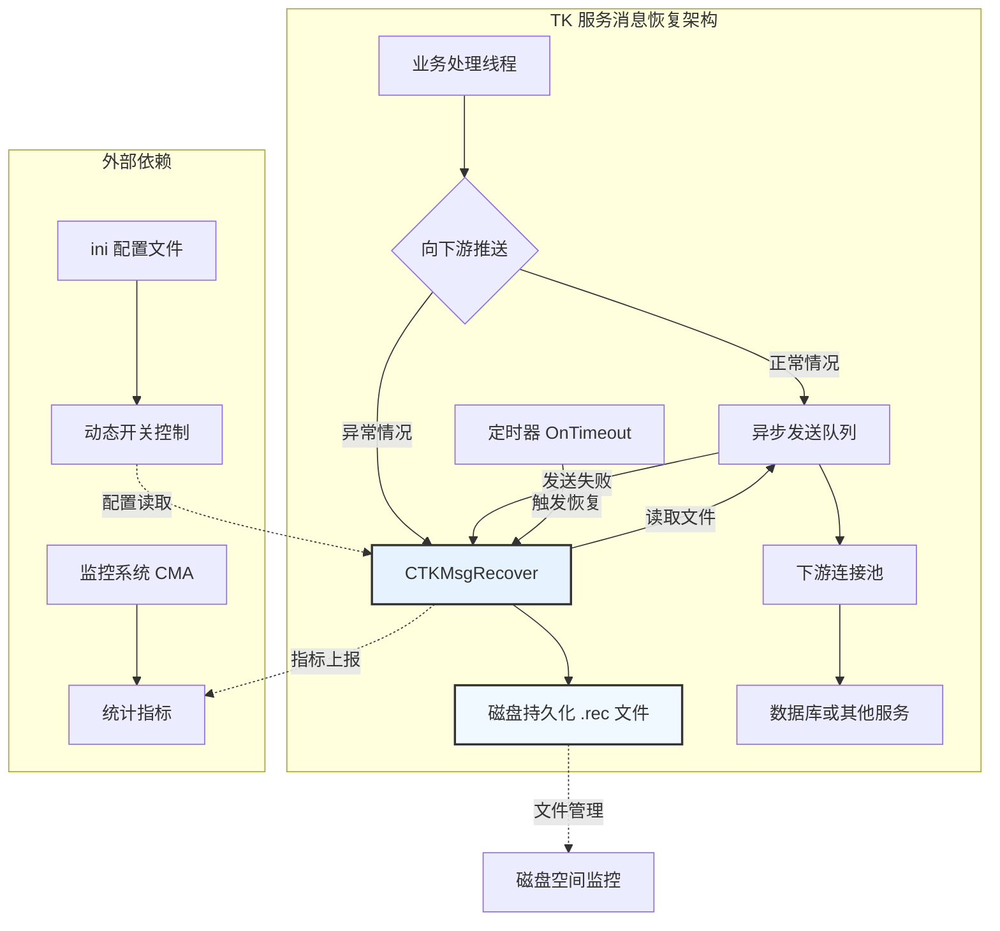

---

categories: 工作 技术文档      # 分类

tags: 工作 技术文档 EVT C++    # 标签

mermaid: true

---


## 一、架构及定义

### 1.1 前言

在一个数据服务的整体架构中，为了应对下游服务因为宕机、升级、切换等导致的短暂断开连接，需要设计对应的容灾机制来进行消息恢复，以保障消息能够抵达最终的数据层。

本文主要以 ESP 服务实际源码为参考，解析 TK 服务（行为数据组）中的消息恢复机制，并与主流容灾方案对比，分析优劣及未来演进方向。以便理解和掌握容灾设计的思路。

### 1.2 消息恢复架构



### 1.3 核心组件源码定义

```cpp
// TKESPService.h 中关键成员定义
class CTKESPService : public CTKWinObjNetService
{
public:
    // 统一的消息恢复管理器（所有通道共用）
    CTKMsgRecover<CTKESPService> m_msgRecover;
    
    // 各下游独立异步队列
    CTKAsyncSendObject<CTKESPService> m_DATAsync;      // DAT通道
    CTKAsyncSendObject<CTKESPService> m_HISAsync2;     // HIS通道
    CTKAsyncSendObject<CTKESPService> m_ESPAsync;      // ESP内部处理
    CTKAsyncSendObject<CTKESPService> m_PushMsgAsync;  // MSG通道
    // ... 其他通道（RP/SPA/AOS/CBEvt）
    
    // 连接池（恢复时重新发送的依赖）
    CTKConnectionPool m_HEBBrokerConnectionPool;  // DAT连接
    CTKConnectionPool m_HISRecoderConnectionPool; // HIS连接
    CTKConnectionPool m_MSGConnectionPool;        // MSG连接
    // ... 其他连接池
    
private:
    // 恢复相关统计（在OnTimeout中更新）
    void UpdateRecoverStats() {
        m_StatStatic.Set("datrecover", m_msgRecover.GetRecoverMsgCnt(1));
        m_StatStatic.Set("datrecord", m_msgRecover.GetRecordMsgCnt(1));
        m_StatStatic.Set("datrecfail", m_msgRecover.GetRecoverFailCnt(1));
        // ... 其他通道统计
    }
};
```

### 1.4 消息类型标识定义

```cpp
// ESP_def.h 中定义的恢复消息类型
#define MSGRECALLESP2DAT    1  // ESP -> DAT 恢复消息
#define MSGRECALLESP2ESP    2  // ESP内部处理恢复消息
#define MSGRECALLESP2HIS    3  // ESP -> HIS 恢复消息  
#define MSGRECALLESP2MSG    4  // ESP -> MSG 恢复消息
#define MSGRECALLESP2STD    5  // ESP -> RP STD 恢复消息
#define MSGRECALLESP2AOS    6  // ESP -> AOS 恢复消息
#define MSGRECALLESP2CBE    7  // ESP -> CBEvt 恢复消息

// 恢复消息的特殊参数标识（在异步回调中识别）
#define Recover_AsycMsg_dwParam 20160630
```


## 二、初始化

### 2.1 异步队列初始化（必须先于恢复注册）

```cpp
// TKESPService.cpp OnInitialUpdate() 中的初始化序列
BOOL CTKESPService::OnInitialUpdate()
{
    // ... 前置初始化（连接池、监控等，与容灾无关）...
    
    // 1. 初始化各通道异步队列（线程数配置化）
    if (!this->m_DATAsync.Init(this, &CTKESPService::OnDATAsyncSend, 100)) {
        TKWriteLog("<ERR>初始化至DAT推送队列失败！！");
        return FALSE;
    }
    
    if (!this->m_HISAsync2.Init(this, &CTKESPService::OnHISAsyncSend2, 100)) {
        TKWriteLog("<ERR>初始化原生数据至HisStore失败！！");
        return FALSE;
    }
    
    if (!this->m_ESPAsync.Init(this, &CTKESPService::OnESPAsyncSend, 100)) {
        TKWriteLog("<ERR>原生事件推送队列初始化失败");
        return FALSE;
    }
    
    // ... 其他队列初始化（MSG/RP/SPA/AOS/CBEvt）...
    
    // 2. 注册消息恢复类型（建立通道->文件->队列的映射）
    m_msgRecover.AddRecMsgType(MSGRECALLESP2DAT, "ESP", "dat", &m_DATAsync);
    m_msgRecover.AddRecMsgType(MSGRECALLESP2ESP, "ESP", "esp", &m_ESPAsync);
    m_msgRecover.AddRecMsgType(MSGRECALLESP2HIS, "ESP", "his", &m_HISAsync2);
    m_msgRecover.AddRecMsgType(MSGRECALLESP2MSG, "ESP", "msg", &m_PushMsgAsync);
    m_msgRecover.AddRecMsgType(MSGRECALLESP2STD, "ESP", "std", &m_SPAServceAync);
    m_msgRecover.AddRecMsgType(MSGRECALLESP2AOS, "ESP", "aos", &m_AOSServceAync);
    m_msgRecover.AddRecMsgType(MSGRECALLESP2CBE, "ESP", "cbe", &m_CBEvtServceAync);
    
    TKWriteLog("消息恢复系统初始化完成，共注册%d个通道", 7);
    
    return TRUE;
}
```

**`AddRecMsgType()` 参数详解：**

- **参数1（id）**：消息类型 ID，在`RecordMsg()`和`GetRecoverMsgCnt()`等函数中使用
- **参数2（module）**：模块名 "ESP"，决定根目录 `TKMsgRecDir\ESP\`
- **参数3（channel）**：通道名，决定子目录 `\dat\`, `\his\` 等
- **参数4（pAsyncObj）**：对应的异步队列指针，恢复时消息将重入此队列

### 2.2 文件目录结构

```
D:TKServer/                    # 根目录
├── ESP/                       # 服务模块名
│   ├── dat/                   # DAT通道目录
│   │   ├── 20251201-1010.rec  # 分钟级文件（每2分钟切换）
│   │   ├── 20251201-1012.rec
│   │   └── 20251201-1014.rec
│   ├── his/                   # HIS通道目录
│   ├── msg/                   # MSG通道目录
│   ├── esp/                   # ESP自身处理目录
│   └── ...                    # 其他通道
└── DTC/                       # DTC SDK独立目录（非ESP管理）
```

**文件命名规则**：`YYYYMMDD-HHMM.rec`
- 基于每分钟的定时器切换，实际每 2 分钟创建新文件
- 恢复时按文件名排序，确保先恢复最早的文件


## 三、消息落盘机制

### 3.1 触发条件

消息落盘在两种情况下触发：
1. **入队时检测队列满**（下游堵塞时，预防性落盘）
2. **落盘消息发送失败时**（已备份消息重发又失败时，补偿性落盘）

### 3.2 下游堵塞时消息落盘

以 ESP 中的源码为例：

```cpp
// 触发点1：PushDAT 时队列满（TKESPService.cpp: 854-907）
DWORD CTKESPService::PushDAT(const DWORD dwPID, const DWORD dwMPID, 
                             const DWORD dwEID, const int newvalue, const int diffvalue)
{
    DWORD ret = SD_EVT_PROCRESULT_OK;
    TKREQOTHER2HEBBROKERPUSHCHANGE req = {0};
    
    // 构造协议头
    req.header.dwLength = sizeof(TKREQOTHER2HEBBROKERPUSHCHANGE) - sizeof(TKHEADER);
    req.header.dwType = TK_REQ | TK_MSG_OTHER2HEBBROKER_PUSH_CHANGE;
    req.dwPID = dwPID;
    req.dwMPID = dwMPID;
    req.stEvent.dwEID = dwEID;
    req.stEvent.dwValue = newvalue;
    req.stEvent.diff = diffvalue;
    
    // 条件1：检查异步队列水位（500,000条阈值）
    if (this->m_DATAsync.GetWaitSendCount() > 500000) {
        ret = SD_EVT_PROCRESULT_ERR_ASYNC_QUEUE_FULL;
    } 
    // 条件2：尝试入队（可能因内存不足失败）
    else if (!this->m_DATAsync.AddMsg(&(req.header))) {
        ret = SD_EVT_PROCRESULT_ERR_ASYNC_QUEUE_FULL;
    }
    
    // 关键落盘逻辑：如果返回队列满错误，立即持久化
    if (SD_EVT_PROCRESULT_ERR_ASYNC_QUEUE_FULL == ret) {
        // 调用统一恢复管理器记录消息
        // 参数：1(DAT通道ID), 原始报文指针, 报文总长度
        this->m_msgRecover.RecordMsg(1, (char *)(&req), 
                                     req.header.dwLength + sizeof(TKHEADER));
        
        // 统计监控
        m_StatStatic.Increase("PushDATRecord", 1);
        TKWriteLog("DAT队列满，消息已落盘: PID=%u, EID=%u", dwPID, dwEID);
    } else {
        // 成功入队，更新业务统计
        ostringstream oss;
        oss << "DAT_" << dwEID;
        m_StatDynamic.Increase(oss.str());
        m_StatDynamic.Increase("DAT_ALL");
    }
    
    return ret;
}
```

### 3.3 已落盘消息重发失败会再次落盘

```cpp
// 触发点2：OnDATAsyncSend 发送失败时（TKESPService.cpp: 911-965）
BOOL CTKESPService::OnDATAsyncSend(PTKHEADER pHeader, DWORD dwParam, BOOL bWaitAck)
{
    // 防御性检查：恢复消息可能为空
    if (NULL == pHeader) {
        TKWriteLog("向Broker推送要发往DAT的数据失败，pHeader=NULL");
        this->m_StatStatic.Increase("PushDATErr");
        
        // 特殊处理：如果是恢复消息本身失败，增加恢复失败计数
        if (Recover_AsycMsg_dwParam == dwParam) {
            this->m_msgRecover.IncreamentRecoverFail(1);
        }
        return TRUE;
    }
    
    CTKBuffer ackbuf;
    int errtype(0);
    
    // 尝试通过连接池发送
    if (!m_HEBBrokerConnectionPool.SendMsg(pHeader, TRUE, 
                                           TK_ACK | pHeader->dwType, 
                                           &ackbuf, &errtype, __FILE__, __LINE__)) {
        // 发送失败处理
        ErrorCodeCollector * pCollector = ErrorCodeCollector::GetInstance();
        if (NULL != pCollector) {
            ostringstream oss;
            oss << "PushDAT" << errtype;  // 记录具体错误码
            pCollector->RecordErrorMsg(oss.str());
        }
        
        this->m_StatStatic.Increase("PushDATErr");
        
        // 关键逻辑：区分是原始消息还是恢复消息失败
        if (Recover_AsycMsg_dwParam == dwParam) {
            // 恢复消息仍然失败，增加恢复失败统计
            this->m_msgRecover.IncreamentRecoverFail(1);
            TKWriteLog("<RECOVER-FAIL> DAT恢复消息发送失败，ErrCode:%d", errtype);
        }
        
        // 无论原始消息还是恢复消息，失败后都再次落盘
        this->m_msgRecover.RecordMsg(1, (char *)pHeader, 
                                     pHeader->dwLength + sizeof(TKHEADER));
    } else {
        // 发送成功，检查ACK确认
        PTKACKOTHER2HEBBROKERPUSHCHANGE pAck = (PTKACKOTHER2HEBBROKERPUSHCHANGE)ackbuf.GetBufPtr();
        if (pAck == NULL || pAck->header.dwParam != 0) {
            // ACK异常也视为失败
            this->m_StatStatic.Increase("PushDATErr");
        }
    }
    
    return TRUE;
}
```

### 3.4 其他通道的统一模式

所有下游通道采用相同模式，仅通道 ID 和异步队列不同：

| 通道        | 推送函数                    | 异步回调                 | 恢复ID | 队列满阈值 | 关键源码位置 |
| ----------- | --------------------------- | ------------------------ | ------ | ---------- | ------------ |
| **DAT**     | `PushDAT()` / `PushDAT64()` | `OnDATAsyncSend()`       | 1      | 500,000    | L854-965     |
| **HIS**     | `PushHIS2()`                | `OnHISAsyncSend2()`      | 3      | 500,000    | L1063-1107   |
| **MSG**     | `PushData2MSGService()`     | `OnPushMsg2MsgService()` | 4      | 500,000    | L1098-1205   |
| **ESP自身** | `PushESP()`                 | `OnESPAsyncSend()`       | 2      | 500,000    | L1312-1380   |
| **CBEvt**   | `PushData2CBEvtService()`   | `OnPushData2CBEvt()`     | 7      | 未显式检查 | L1247-1284   |

**消息落盘的原则**：

1. 所有`PushXxx()`函数在`AddMsg()`前检查`GetWaitSendCount() > 500000`
2. 所有`OnXxxAsyncSend()`在`SendMsg()`失败后调用`RecordMsg()`
3. 恢复消息通过`dwParam == Recover_AsycMsg_dwParam`标识


## 四、消息恢复机制

### 4.1 TK 服务定时器逻辑

```cpp
// 核心定时函数 OnTimeout()（TKESPService.cpp:442-568）
BOOL CTKESPService::OnTimeout(struct tm * pTime)
{
    // ... 其他定时任务（配置刷新、监控上报等，与容灾无关）...
    
    // 1. 同步恢复统计到CMA监控系统
    this->m_StatStatic.Set("datrecover", this->m_msgRecover.GetRecoverMsgCnt(1));
    this->m_StatStatic.Set("datrecord", this->m_msgRecover.GetRecordMsgCnt(1));
    this->m_StatStatic.Set("datrecfail", this->m_msgRecover.GetRecoverFailCnt(1));
    
    this->m_StatStatic.Set("esprecover", this->m_msgRecover.GetRecoverMsgCnt(2));
    this->m_StatStatic.Set("esprecord", this->m_msgRecover.GetRecordMsgCnt(2));
    this->m_StatStatic.Set("esprecfail", this->m_msgRecover.GetRecoverFailCnt(2));
    
    this->m_StatStatic.Set("hisrecover", this->m_msgRecover.GetRecoverMsgCnt(3));
    this->m_StatStatic.Set("hisrecord", this->m_msgRecover.GetRecordMsgCnt(3));
    this->m_StatStatic.Set("hisrecfail", this->m_msgRecover.GetRecoverFailCnt(3));
    
    // ... MSG/RP/SPA/AOS/CBEvt通道统计类似 ...
    
    // 2. 驱动恢复引擎执行（这个函数是重点）
    this->m_msgRecover.OnTimesout(pTime);
    
    // 3. 其他定时任务
    m_dtcGeneralSidClient.OnTimesout(pTime);  // DTC SDK自有恢复
    bgs::CServiceCLS::GetInstance()->OnTimeout();  // 远程日志订阅
    
    return TRUE;
}
```

### 4.2 CTKMsgRecover::OnTimesout() 内部逻辑

```cpp
// TKMsgRecover.h 中的恢复调度逻辑（简化版）
template <class T>
void CTKMsgRecover<T>::OnTimesout(struct tm *pTime)
{
    // 步骤1：检查磁盘空间（自动降级）
    CheckDiskFreeSpace();  // 空间不足会设置 bRecordable_ = false
    
    // 步骤2：更新恢复文件（每2分钟切换）
    if (pTime->tm_min % 2 == 0) {
        UpdateRecFile(pTime);
    }
    
    // 步骤3：读取配置开关（支持热更新）
    UpdateSwitch(pTime);  // 读取 MsgRecover.Recordable/Recoverable
    
    // 步骤4：统计清零与日志输出
    map<unsigned int, CTKMsgRecoverElement<CTKAsyncSendObject<T>>>::iterator iter;
    bool bHasNewRecord = false;
    
    for (iter = m_recMap.begin(); iter != m_recMap.end(); ++iter) {
        unsigned int recordCnt = ::InterlockedExchange(&(iter->second.WriteFilePerSec_), 0);
        unsigned int recoverCnt = ::InterlockedExchange(&(iter->second.RecPerSec_), 0);
        unsigned int recoverFailCnt = ::InterlockedExchange(&(iter->second.RecFailPerSec_), 0);
        
        if (recordCnt > 0) {
            TKWriteLog("产赀[%s]%d条", iter->second.name_.c_str(), recordCnt);
            bHasNewRecord = true;  // 标记有新记录
        }
        if (recoverCnt > 0) {
            TKWriteLog("志鹸[%s]%d条", iter->second.name_.c_str(), recoverCnt);
        }
        if (recoverFailCnt > 0) {
            TKWriteLog("志鹸[%s]失败%d条", iter->second.name_.c_str(), recoverFailCnt);
        }
    }
    
    // 步骤5：恢复执行条件判断
    // 仅当满足以下条件时才执行恢复：
    // 1. 无新消息正在落盘（bHasNewRecord == false）
    // 2. 恢复开关开启（bRecoverable_ == true）
    // 3. 磁盘空间充足（bRecordable_ == true）
    if (!bHasNewRecord && bRecoverable_) {
        RecoverMsg();  // 执行实际恢复
    }
}
```

### 4.3 文件恢复核心逻辑

```cpp
// CTKMsgRecoverElement::RecoverMsg() 核心流程
template <class T>
void CTKMsgRecoverElement<T>::RecoverMsg()
{
    // 条件检查双重保险
    if (this->WriteFilePerSec_ > 0) {  // 条件1：正在记录新消息
        return;
    }
    
    if (this->pAsyncObj_->GetWaitSendCount() > recoverQueueLimit_) {  // 条件2：队列超过限制
        TKWriteLog("队列水位%d超过限制%d，暂停恢复", 
                   this->pAsyncObj_->GetWaitSendCount(), recoverQueueLimit_);
        return;
    }
    
    // 1. 构造文件搜索模式
    char szFindPattern[_MAX_PATH];
    sprintf(szFindPattern, "TKMsgRecDir\\%s\\%s\\*.rec", 
            this->srvName_.c_str(), this->name_.c_str());
    TKAddPath(szFindPattern);  // 添加路径前缀
    
    // 2. 获取所有.rec文件（按名称自动排序）
    set<string> files;
    if (!this->GetAllFiles(szFindPattern, files)) {
        TKWriteLog("未找到恢复文件: %s", szFindPattern);
        return;
    }
    
    // 3. 顺序处理文件（每次只处理一个文件）
    for (const string& filename : files) {
        // 跳过当前正在写入的文件
        if (filename == this->recFileName_) {
            continue;
        }
        
        char szFullPath[_MAX_PATH];
        sprintf(szFullPath, "TKMsgRecDir\\%s\\%s\\%s", 
                this->srvName_.c_str(), this->name_.c_str(), filename.c_str());
        TKAddPath(szFullPath);
        
        TKWriteLog("<RECOVER> 开始处理文件: %s", szFullPath);
        
        // 4. 读取文件内容
        HANDLE hFile = ::CreateFile(szFullPath, GENERIC_READ, 
                                     FILE_SHARE_READ, NULL, 
                                     OPEN_EXISTING, FILE_ATTRIBUTE_NORMAL, NULL);
        
        if (hFile == INVALID_HANDLE_VALUE) {
            TKWriteLog("<RECOVER> 无法打开文件: %s, Error:%d", 
                      szFullPath, GetLastError());
            continue;
        }
        
        DWORD dwFileSize = ::GetFileSize(hFile, NULL);
        if (dwFileSize == 0) {
            // 空文件直接删除
            ::CloseHandle(hFile);
            ::DeleteFile(szFullPath);
            TKWriteLog("<RECOVER> 删除空文件: %s", szFullPath);
            continue;
        }
        
        // 5. 读取文件到缓冲区
        CTKBuffer buffer;
        if (!buffer.ExpandTo(dwFileSize)) {
            ::CloseHandle(hFile);
            TKWriteLog("<RECOVER> 缓冲区分配失败: %s", szFullPath);
            continue;
        }
        
        DWORD dwRead = 0;
        BOOL bRead = ::ReadFile(hFile, buffer.GetBufPtr(), dwFileSize, &dwRead, NULL);
        ::CloseHandle(hFile);
        
        if (!bRead || dwRead != dwFileSize) {
            TKWriteLog("<RECOVER> 读取文件失败: %s", szFullPath);
            continue;
        }
        
        // 6. 解析并恢复消息
        int nLoaded = loadRecFile(buffer);
        if (nLoaded > 0) {
            TKWriteLog("<RECOVER> 成功恢复 %d 条消息，文件: %s", 
                      nLoaded, filename.c_str());
            
            // 7. 删除已成功处理的文件
            if (::DeleteFile(szFullPath)) {
                TKWriteLog("<RECOVER> 删除已处理文件: %s", szFullPath);
            } else {
                TKWriteLog("<RECOVER> 删除文件失败: %s, Error:%d", 
                          szFullPath, GetLastError());
            }
            
            break;  // 关键：每次只处理一个文件
        }
    }
}
```

### 4.4 消息解析与重入队列

```cpp
template <class T>
int CTKMsgRecoverElement<T>::loadRecFile(CTKBuffer &buffer)
{
    DWORD dwLength = buffer.GetBufLen();
    char *pData = buffer.GetBufPtr();
    
    int cnLoadRec = 0;
    while (dwLength >= sizeof(TKHEADER)) {
        PTKHEADER pMsg = (PTKHEADER)pData;
        
        // 校验数据完整性
        if (dwLength < pMsg->dwLength + sizeof(TKHEADER)) {
            break;  // 数据不完整
        }
        
        // 校验消息魔术字（防数据损坏）
        if (pMsg->dwMagic != TKGetMemDWORDCheckSum(pMsg + 1, pMsg->dwLength)) {
            break;  // 数据损坏
        }
        
        cnLoadRec++;
        
        // 关键：恢复消息重新入队
        ::InterlockedIncrement(&RecPerSec_);  // 恢复计数
        
        // 特殊参数标识这是恢复消息
        this->pAsyncObj_->AddMsg(pMsg, Recover_AsycMsg_dwParam, TRUE, pMsg->dwSerial);
        
        // 移动指针到下一个消息
        dwLength -= pMsg->dwLength + sizeof(TKHEADER);
        pData += pMsg->dwLength + sizeof(TKHEADER);
    }
    
    return cnLoadRec;
}
```


## 五、容灾机制的分析

### 5.1 与主流容灾架构的对比

| **对比维度**   | **TKESPService 现有机制**                     | **主流容灾架构**                          | **对比分析**               |
| -------------- | --------------------------------------------- | ----------------------------------------- | -------------------------- |
| **架构定位**   | **消息级容灾**，保障单服务内异步消息不丢失    | **系统级/业务级容灾**，保障整个业务连续性 | 定位不同，解决不同层次问题 |
| **容灾范围**   | 仅应对**下游服务短暂不可用**（秒级到分钟级）  | 应对**硬件故障、机房灾难、地域灾难**      | 范围有限但够用             |
| **RPO/RTO**    | RPO≈0（消息立即落盘），RTO=分钟级（定时恢复） | RPO≈0，RTO=秒级到分钟级（自动切换）       | RTO较长但可接受            |
| **实现成本**   | **极低**（仅本地磁盘IO）                      | **极高**（冗余硬件、专线网络、复杂运维）  | 成本优势明显               |
| **复杂度**     | **低**（逻辑内聚，无外部依赖）                | **高**（分布式一致性、流量切换等）        | 简单可靠                   |
| **数据一致性** | **最终一致性**（可能重复，依赖业务去重）      | **强一致性/最终一致性**（依赖具体方案）   | 满足业务需求               |
| **适用场景**   | 非核心链路、允许延迟、成本敏感                | 核心业务、金融级要求、高可用性            | 场景匹配度高               |

### 5.2 当前方案的优劣

#### 优点：

1. **成本效益极高**：仅消耗本地磁盘空间，无需额外硬件或网络投资
2. **部署简单**：无需复杂的集群配置或外部中间件依赖
3. **针对性强**：完美解决下游服务抖动、重启、短时不可用问题
4. **可控性强**：恢复时机、速度可通过配置灵活调整
5. **监控完善**：完整的统计指标（record/recover/recfail）便于运维

#### 缺点：

1. **单点故障风险**：恢复文件在本地磁盘，机器宕机可能导致数据丢失
2. **恢复延迟**：依赖定时器（分钟级），非实时恢复
3. **容量限制**：受单机磁盘容量限制，无法应对海量消息积压
4. **缺乏全局事务**：仅恢复消息，不保证业务事务一致性
5. **手动干预多**：磁盘满、持续失败等需要人工处理


### 5.3 后期改进方向

#### 增加远程备份：

除了本地备份外，还可以通过 DTC 异步落盘到 Kafka，或是备份到其他数据库，这样就不会被本地磁盘的容量限制消息备份量了。示例代码如下：

```cpp
class CRemoteBackupRecover : public CTKMsgRecover<T> {
public:
    virtual BOOL RecordMsg(unsigned int id, char* pMsg, unsigned int msgLen) {
        // 1. 本地落盘
        BOOL bLocal = __super::RecordMsg(id, pMsg, msgLen);
        
        // 2. 异步上传到对象存储
        if (bLocal && m_bEnableRemoteBackup) {
            AsyncUploadToOSS(id, pMsg, msgLen);
        }
        return bLocal;
    }
};
```

#### 智能恢复速率控制：

```cpp
// 根据下游健康状态动态调整恢复速度
void AdaptiveRecoverSpeed() {
    float successRate = GetRecentSuccessRate();
    if (successRate < 0.3) {
        // 下游严重异常，大幅降低恢复速度
        SetRecoverBatchSize(10);
    } else if (successRate < 0.7) {
        // 下游不稳定，适当降低速度
        SetRecoverBatchSize(50);
    } else {
        // 下游健康，全速恢复
        SetRecoverBatchSize(200);
    }
}
```

#### 增强监控告警：

- 文件积压数量超过阈值告警
- 单文件处理时间过长告警
- 恢复成功率持续下降告警

#### 架构演进：

从本地文件到分布式存储：

当前：本地磁盘文件 → 改进：本地缓存 + 远程存储 → 目标：分布式消息队列

#### 支持事务消息：

```cpp
// 支持事务型消息恢复
struct TransactionalMessage {
    string transactionId;
    vector<char> message;
    int retryCount;
    time_t expireTime;
};
```

#### 运维自动化？

- 自动磁盘空间管理
- 恢复失败自动根因分析
- 一键切换恢复策略

### 5.4 对云架构的思考

在容器化、微服务架构下，消息恢复机制可以演进为：
1. **Sidecar 模式**：恢复功能作为独立 Sidecar 容器
2. **Operator 模式**：自定义资源管理恢复策略
3. **Serverless 模式**：按需触发恢复函数


## 六、附录

### 6.1 关键监控指标

CMA 监控的指标以 ESP 服务为例，其他服务也是类似的格式，放在下面以便参考。

```cpp
// 监控指标定义与含义
struct RECOVER_METRICS {
    // DAT通道指标
    unsigned int datrecord;    // 每分钟DAT落盘数（反映下游不可用程度）
    unsigned int datrecover;   // 每分钟DAT恢复数（反映恢复速度）
    unsigned int datrecfail;   // 每分钟DAT恢复失败数（反映下游仍不可用）
    
    // HIS通道指标
    unsigned int hisrecord;
    unsigned int hisrecover; 
    unsigned int hisrecfail;
    
    // MSG通道指标
    unsigned int msgrecord;
    unsigned int msgrecover;
    unsigned int msgrecfail;
    
    // 系统级指标
    unsigned long long disk_free;  // 磁盘剩余空间（字节）
    bool recover_enabled;          // 恢复开关状态
    bool record_enabled;           // 记录开关状态
};
```

### 6.2 常见问题排查指南

| **现象**             | **可能原因**        | **排查步骤**                                                 | **解决方案**                   |
| -------------------- | ------------------- | ------------------------------------------------------------ | ------------------------------ |
| `datrecord`持续增长  | DAT下游长时间不可达 | 1. 检查DAT服务状态<br>2. 查看网络连接<br>3. 检查`PushDATErr`指标 | 修复下游服务，或临时关闭恢复   |
| `datrecover`为0      | 恢复未触发          | 1. 检查`MsgRecover.Recoverable`配置<br>2. 检查磁盘空间<br>3. 查看是否有新记录 | 开启恢复开关，清理磁盘         |
| `datrecfail`持续上涨 | 恢复后仍发送失败    | 1. 检查下游服务状态<br>2. 查看ACK错误码<br>3. 检查协议兼容性 | 修复下游问题，或调整恢复速度   |
| 磁盘空间不足         | 文件未及时清理      | 1. 检查.rec文件数量<br>2. 查看恢复成功率<br>3. 检查文件删除逻辑 | 手动清理旧文件，或优化清理策略 |
| 恢复顺序错乱         | 文件读取顺序问题    | 1. 检查文件命名规范<br>2. 查看恢复日志时间戳                 | 确保文件按时间排序读取         |

### 6.3 运行时配置热更新

```ini
; TKESPService.ini 配置文件
[MsgRecover]
; 总开关控制
Recoverable=1          ; 1=开启恢复，0=关闭恢复（默认1）
Recordable=1           ; 1=开启记录，0=关闭记录（默认1）

; 恢复队列控制
QueueLimit=30000       ; 恢复队列长度限制（默认30000）

; 文件管理
FileRotateMinutes=2    ; 文件切换间隔（分钟，默认2）
MaxFileAge=1440        ; 文件最大保留时间（分钟，默认24小时）

[DAT]
; DAT通道特定配置
AsyncThreads=100       ; 异步线程数（默认100）
QueueFullThreshold=500000 ; 队列满阈值（默认500,000）

[Process]
; 处理线程配置
ProcessSDThreadNum=200 ; 业务处理线程数（最小50）
SlowProcThreshold=1000 ; 慢操作阈值（毫秒，默认1000）
```

**TK 服务对 ini 配置热更新的逻辑**：
```cpp
void CTKESPService::OnTimeout(struct tm * pTime)
{
    // 每3秒检查一次配置（避免频繁读取）
    if (pTime->tm_sec % 3 == 0) {
        int recoverflag = TKGetIniInt("MsgRecover", "Recoverable", 1, NULL);
        int recordflag = TKGetIniInt("MsgRecover", "Recordable", 1, NULL);
        
        // 动态更新开关状态
        UpdateSwitch(recoverflag, recordflag);
    }
}
```


## 七、总结

行为数据组中设计的 TK 消息恢复机制是一个**精巧、实用、成本效益高**的设计。它精准地解决了特定场景下（下游服务短暂不可用）的消息可靠性问题，同时避免了传统容灾方案的复杂性和高成本。

**核心价值**：
- ✅ **简单可靠**：无外部依赖，逻辑内聚
- ✅ **成本极低**：仅需本地磁盘空间
- ✅ **针对性强**：完美解决下游抖动问题
- ✅ **可控性好**：配置灵活，监控完善

**适用场景**：
- 非核心业务链路
- 允许分钟级延迟恢复
- 成本敏感型项目
- 已有复杂架构，仅需增加消息保障

**不适用场景**：
- 金融级强一致性要求
- 毫秒级恢复时间要求
- 应对硬件/机房级灾难
- 海量消息（TB级）持久化

这个设计体现了**软件工程中的务实哲学**：不追求过度设计，而是用最简单的方案解决最实际的问题。对于大多数互联网业务场景，这种轻量级的消息恢复机制已经足够可靠且高效。


## 附件

### 1）xuxw 文档《EVT&ESP数据恢复方案备忘录.docx》

一、总结当前容灾场景如下（由上至下）

1.Broker 到 ESP 请求失败（下游服务崩溃）

2.Broker 到 NOS 请求失败（下游服务崩溃）

3.ESP 到 NOS 请求失败（下游服务崩溃）

4.NOS 到 Redis 请求失败（网络或下游服务崩溃）

二、相应的容灾方式如下

1.对于上述第 1 类故障，Broker 使用消息重发组件重发原生事件请求，实现自动恢复（已实现）

2.对于上述第 3 类故障，ESP 使用消息重发机制或类似机制重发原生事件请求，进行自动恢复（若宽负责）

3.对于上述第 2、4 类故障，采用人工审核方式进行恢复，具体方案如下：

- 由 Broker 统一进行故障识别，调用 DTCSDK 输出日志文件（学伟负责）
- 部署 DHL 及相关配置，申请 kfk 专用 topic，采集日志文件（志宇负责）
- 通过 Flink 将待恢复数据导入 Mysql，并设计 Mysql 表结构（学伟负责）
- 前端功能设计及 API 实现，涵盖以下功能：错误统计、查询待恢复积分列表及状态、生成 EOM 配置规则、修改 Flink 配置规则的批号等（业天负责）
- 扩展 EOM 功能，实现从 mysql 数据源拉取数据进行恢复的逻辑，并且在 mysql 中记录恢复结果、错误明细（亚东负责）

