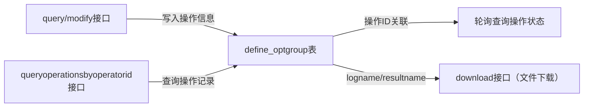
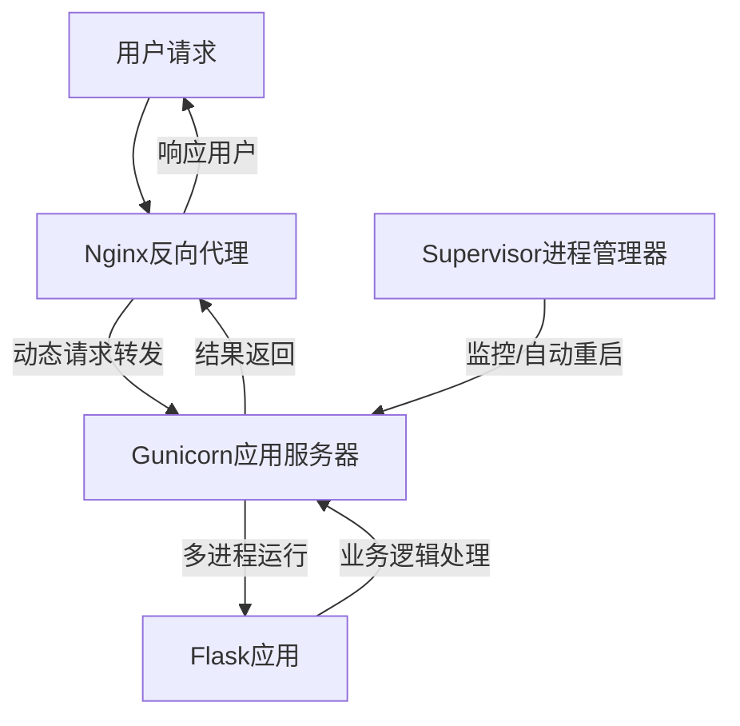

---

categories: 工作 系统相关       # 分类

tags: 工作 系统相关 EVT python Linux     # 标签

mermaid: true

---


## 前言

EOM 这套东西怎么能这么复杂，我实在想不明白为什么这么简单的一个需求，当初会搭建这么复杂的一套东西。甚至怀疑是前同事为了练手才搭建了一套这么复杂架构的系统。

EOM 目前：小题大做的架构设计、一堆无伤大雅的 bug、机器重启就会宕机需要手动维护。

但我又不想花时间写一套替代系统，投入产出比太低了。

所以这里整理出一篇比较系统的 EOM 维护手册，提供给研发和运维，方便后期维护和使用。

## EOM 系统介绍

EOM 产品是以 TKEvtOperationService 为基础，通过封装接口，以 MIS 页面形式向外提供 EVT 积分的批量查询和修改的产品。[^1]

### 1）系统架构


### 2）服务详情

#### EOMAPI

- py 的 WEB 服务。对外提供积分查询、积分修改、操作历史查看等接口。

- 部署在服务器 10.30.127.32（centos）上，通过 Supervisor 管理。

- git 项目：`eom-product`

  > **历史遗留问题**：（经过我的挖掘终于整明白了）
  >
  > 一开始 EOMAPI 的 git 项目就叫 eom-api，后来若宽在这个基础上重写，然后新建了一个 git 项目叫 eom-product，可以理解为 EOMAPI 2.0，**之前的 git 项目 eom-api 就废弃了**。
  >
  > **现在线上实际使用的都 eom-product** ，但服务名依旧保持叫 eomapi。
  {: .prompt-tip }

- git 地址：

  - https://pscgit.bj.tkoffice.cn/hansb/eom-product.git（当前实际部署用的这个）
  - https://pscgit.bj.tkoffice.cn/restapi/eom-api.git（公共库，这个名称叫 eom-api 但内容是对的）

- centos 上的项目位置：`/data/wwwroot/eom-product`

- centos 上的`supervisor_eomproduct.ini`配置：

  ```ini
  [program:eomapi]
  directory=/data/wwwroot/eom-product/
  command=/data/wwwroot/eom-product/venv/bin/gunicorn -c gunicorn.py app:app
  ```

- mis 接口：见文档 3 [^3]，


#### EOMFILE

- py 的 WEB 服务。向 EOMAPI 服务提供文件上传和文件下载接口。
- 部署在 192.168.7.101（WinServer）上，打包生成的 exe 注册为服务，服务名 EOMFileService，通过 WinServer 管理。
- git 项目：`eomfile`
- git 地址：
  - https://pscgit.bj.tkoffice.cn/hansb/eomfile.git（我的仓库）
  - 当前实际部署的服务应该是当初若宽打包的，但是他离职以后仓库就没了，我是从朴宸的仓库 fork 的，朴宸是从若宽仓库 fork 的，所以代码应该是没问题的（但我也没验证过）。
- WinServer 上的项目位置：`D:\TKServer\eomfile\eomfile.exe`
- 存储的文件位置：`D:\TKServer\eomfile\data\`


#### TKEvtOperationService

- c++ 的 TK 服务。与 NOS 服务交互，实现积分查询和积分修改操作。 

- 部署在 192.168.7.101（WinServer）上，常规的 Win-TK 服务管理方式。

- git 项目：`TKEVTOperationService`

- git 地址：

  - https://pscgit.bj.tkoffice.cn/hansb/tkevtoperationservice.git（我的仓库）
  - https://pscgit.bj.tkoffice.cn/evt/tkevtoperationservice.git（公共仓库）

- WinServer 上的 TKEvtOperationService.ini 配置：

  ```ini
  [NetSettings]
  ListenPort = 33333
  MaxNetClient = 41000
  ClientPerThread = 10
  
  [Config]
  ;文件路径,只加载一次
  RootPath=D:\TKServer\eomfile\data
  ;是否异步处理每行数据,默认0即使用同步处理每行数据
  ;IsAsyn=0
  
  [MySQLConfig]
  ;addr = "192.168.10.147:4306"
  addr = "tkcvs-001-mysql.service.jjsrv.local:4306"
  user = "srv_cvs_progm"
  pwd = "K2bCttnp"
  db = "CVS"
  
  [EVTConfig]
  ClusterNum = 6;
  ;通用集群 Common
  cluster0 = 10.22.125.37:30707:20,10.22.125.38:30707
  ;捕鱼集群
  cluster1 = 10.22.125.17:30707:20,10.22.125.18:30707:20
  ;千炮集群
  cluster2 = 10.30.120.90:30707:20,10.30.120.91:30707,10.30.120.92:30707
  ;标签集群
  cluster3 = 10.22.125.14:30707:20
  ;休闲集群
  ;cluster4 = 10.30.120.93:30707:20,10.30.120.94:30707,10.30.120.70:30707,10.30.120.71:30707
  cluster4 = 10.30.127.151:30707,10.30.127.152:30707,10.30.127.153:30707
  ;结果班车集群
  cluster5 = 10.30.125.110:30707:20,10.30.125.111:30707,10.30.125.112:30707
  ```

- 【占位】

### 3）MySQL 配置

- MySQL 配置位于 tk 机房（内网），通过堡垒机 7.44 可以直接访问。
- EOMAPI 会读取一系列配置表 `define_nosdata_*` ，获取积分配置，这里不再介绍。
- EOMAPI 会读写 `define_optgroup`，该表是所有操作的核心记录表。类似于 EOM 产品的 “数据账本”，存储所有操作记录和业务配置，支撑接口的查询 / 修改能力，关联操作全生命周期（创建→执行→结果）。

- define_optgroup 的相关操作流程：



- define_optgroup 的字段说明：


| 字段名          | 类型/含义                                                                 | 代码关联逻辑                                                                 |
|-----------------|--------------------------------------------------------------------------|------------------------------------------------------------------------------|
| id              | 主键（INT），操作唯一标识                                                | 通过`LAST_INSERT_ID()`获取，用于轮询查询操作状态                             |
| description     | 字符串，操作描述（如“捕鱼集群数据查询”）| 从接口`config.description`获取，写入INSERT语句                              |
| executed        | 数值（0/1），是否执行完成                                                | 初始值0，由后台任务更新                                                     |
| handleres       | 数值（0/10/其他），操作结果状态（10=成功，0=处理中，其他=失败）| 轮询查询的核心字段，判断操作是否完成                                         |
| conf            | JSON字符串，操作配置（集群、文件名、操作类型query/modify等）| 由接口拼接JSON后写入，如`{"cluster":"fish","model":"modify"}`                |
| operatorid      | 数值，操作员ID                                                           | 从接口`config.operatorid`获取，用于按操作员查询操作记录                      |
| operatorname    | 字符串，操作员名称                                                       | 从接口`config.operatorname`获取                                             |
| sourcename      | 字符串，上传文件名称                                                     | 上传文件后更新的文件名，关联文件下载接口                                    |
| note            | 字符串，备注（如modify接口的编辑方式+EID列表：`inc_1001,1002`）| 仅modify接口填充，记录修改方式和目标EID                                      |
| create_time     | 时间戳，操作创建时间                                                     | 用于按时间范围查询操作记录                                                  |
| last_modify_time| 时间戳，最后修改时间                                                     | 用于查询最新操作状态                                                        |
| logname         | 字符串，操作日志文件名                                                   | 操作成功后返回，支持下载                                                     |
| resultname      | 字符串，操作结果文件名                                                   | 操作成功后返回，支持下载                                                     |
| status          | 数值，操作状态（与handleres关联）| `queryoperationsbyoperatorid`接口查询字段                                    |


## EOM 使用指南

主要内容见参考文档 2 [^2]。

其他注意点：

- 文档上传的时候会显示红框，这个不用管，是 mis 的问题，实际是上传成功了。
- 结果文档下载不成功的话就换个浏览器，或者鼠标右键 - “链接另存为”，就可以了。
- 单次操作最好不要超过 5000 个用户，多余此数量时建议拆分文件。（多的可能失败？我也没试过）


## 维护指南

### 1）查询失败

- 优先检查输入的 csv 文件格式是否正确。
- 通过日志查看具体报错。
- 仔细阅读参考文档 2《EOM 产品文档》。
- 如果查询的 csv 上传/下载失败的话，可能就是某个服务宕了，需要在服务器上检查上面提到的 3 个服务的状态。

### 2）服务拉起

- 依次检查上面提到的 3 个服务状态，如果哪个有问题的话，直接拉起。

- centos 上是通过 supervisor 管理的，通过以下命令检查服务状态：

  ```bash
  supervisorctl status
  ```

- WinServer 上直接查看服务菜单中的服务状态即可。


## 名词解释

### Gunicorn[^4]

#### 一、Gunicorn 核心定义

Gunicorn（Green Unicorn）是 Python 专属的 WSGI HTTP 服务器，核心作用是将 Flask/Django 等 Python Web 应用封装为可稳定运行的服务进程，解决 Flask 自带开发服务器无法适配生产环境的问题，提供多进程/线程并发、请求管控、日志记录等生产级能力。

#### 二、整体部署框架（Flask + Gunicorn + Supervisor）



- **Supervisor**：进程管控层，仅负责监控Gunicorn进程状态，当Gunicorn崩溃/终止时自动重启，保障服务不中断；
- **Gunicorn**：应用运行层，绑定内网端口（如127.0.0.1:13456），通过多进程/线程处理Nginx转发的动态请求，调用Flask代码并返回结果；
- **Flask**：业务逻辑层，仅负责实现接口/页面的核心业务逻辑（如数据查询、计算），不处理网络请求和进程管理；
- **Nginx**：前端代理层（补充），接收外网请求，处理静态资源，转发动态请求至Gunicorn，保障外网访问安全。

#### 三、使用Gunicorn的必要性（对比核心能力）

| 能力维度       | Flask 自带服务器      | Gunicorn                  |
|----------------|-----------------------|---------------------------|
| 并发处理       | 单进程单线程，仅支持1个并发请求 | 多进程/线程（如4进程2线程），支持高并发 |
| 稳定性         | 崩溃后无法自启，易中断 | 进程隔离，崩溃后由Supervisor自动重启 |
| 生产特性       | 无日志/超时/连接限制   | 支持日志分级、超时控制、连接数限制     |
| 安全适配       | 直接暴露外网有安全风险 | 仅绑定内网端口，通过Nginx反向代理对外 |

#### 四、核心总结

1. Gunicorn 是 Flask 应用走向生产的核心载体，解决并发、稳定性、管控能力不足的问题；
2. Supervisor 仅管控 Gunicorn 进程，不介入请求处理，保障服务持续运行；
3. 生产环境需通过 “Nginx+Gunicorn+Supervisor” 分层架构，兼顾并发、稳定、安全三大核心需求


## 参考

[^1]: 《EOM产品用户手册.docx》 - E:\CODE\eom-product\eom-product\doc\
[^2]: 《EOM产品文档.docx》 - E:\CODE\eom-product\eom-product\doc\
[^3]: 《接口文档.md》 - E:\CODE\eom-product\eom-product\doc\

[^4]: 豆包
