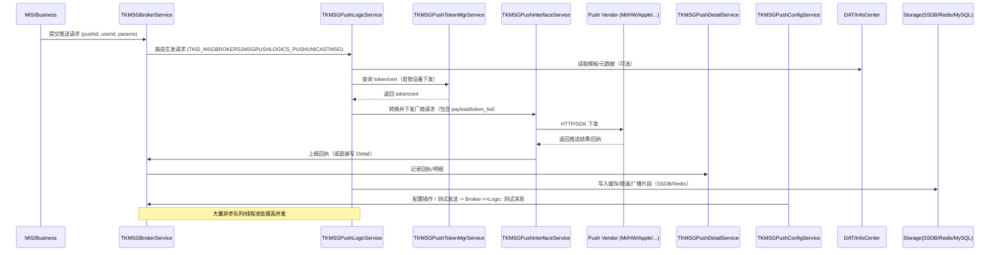
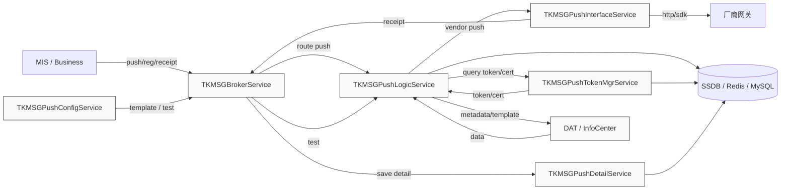

**PUSH 系统架构与消息流（Mermaid）**

下面包含两张 mermaid 图：一张为单条消息的时序图（sequenceDiagram），另一张为服务关系/调用流程图（flowchart）。

```mermaid
sequenceDiagram
    participant Web as MIS/Business
    participant Broker as TKMSGBrokerService
    participant Logic as TKMSGPushLogicService
    participant TokenMgr as TKMSGPushTokenMgrService
    participant Interface as TKMSGPushInterfaceService
    participant Vendor as Push Vendor (Mi/HW/Apple/...)
    participant Detail as TKMSGPushDetailService
    participant Config as TKMSGPushConfigService
    participant DAT as DAT/InfoCenter
    participant Store as Storage(SSDB/Redis/MySQL)

    Web->>Broker: 提交推送请求 (pushid, userid, params)
    Broker->>Logic: 路由生发请求 (TKID_MSGBROKERS2MSGPUSHLOGICS_PUSHUNICASTMSG)
    Logic->>DAT: 读取模板/元数据（可选）
    Logic->>TokenMgr: 查询 token/cert（若按设备下发）
    TokenMgr-->>Logic: 返回 token/cert
    Logic->>Interface: 转换并下发厂商请求（包含 payload/token_list）
    Interface->>Vendor: HTTP/SDK 下发
    Vendor-->>Interface: 返回推送结果/回执
    Interface->>Broker: 上报回执（或直接写 Detail）
    Broker->>Detail: 记录回执/明细
    Logic->>Store: 写入缓存/限速/广播片段（SSDB/Redis）
    Config->>Broker: 配置操作 / 测试发送 -> Broker->>Logic: 测试消息

    Note over Broker,Logic: 大量异步队列/线程池处理高并发
```

```mermaid
flowchart LR
    Web[MIS / Business]
    Broker[TKMSGBrokerService]
    Logic[TKMSGPushLogicService]
    Interface[TKMSGPushInterfaceService]
    TokenMgr[TKMSGPushTokenMgrService]
    Detail[TKMSGPushDetailService]
    Config[TKMSGPushConfigService]
    DAT[DAT / InfoCenter]
    Store[(SSDB / Redis / MySQL)]

    Web -->|push/reg/receipt| Broker
    Broker -->|route push| Logic
    Logic -->|vendor push| Interface
    Interface -->|http/sdk| Vendor[厂商网关]
    Interface -->|receipt| Broker
    Broker -->|save detail| Detail

    Logic -->|query token/cert| TokenMgr
    TokenMgr -->|token/cert| Logic

    Logic -->|metadata/template| DAT
    DAT -->|data| Logic

    Config -->|template / test| Broker
    Broker -->|test| Logic

    Logic --> Store
    TokenMgr --> Store
    Detail --> Store

    classDef svc fill:#f8f9fa,stroke:#333,stroke-width:1px;
    class Broker,Logic,Interface,TokenMgr,Detail,Config,DAT svc;
```

